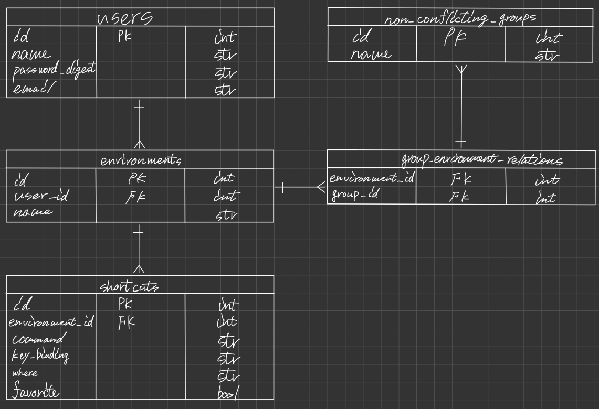
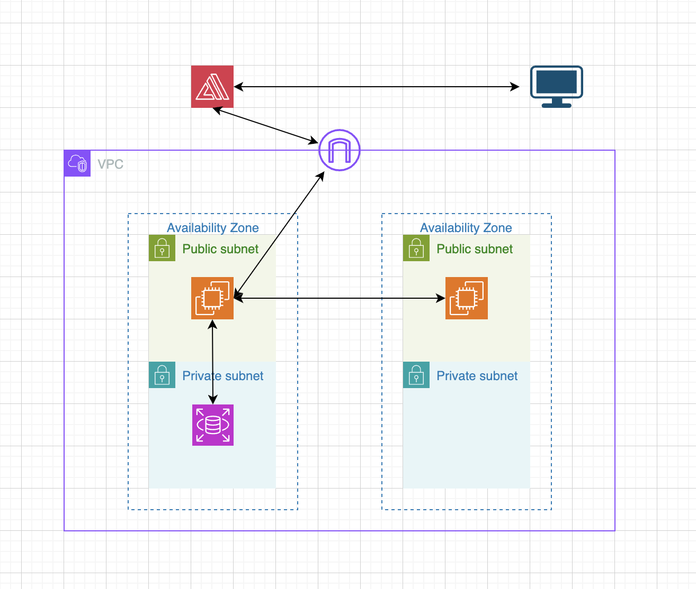

# ショートカットマネージャー　(現在はデプロイ停止中)

## 開発のきっかけ
私は普段からPCのショートカットを自作し多用しています。
最近は登録済みのショートカットの数が増えすぎてしまい、新しいショートカットを作成する際に競合が多発するため異なる環境間でのショートカットを一括で管理し、競合を起こさないキーを見つける際に発生する苦労をなくしたいと考え、本アプリを作成しました。

## ユーザの課題
* 競合を起こすショートカットを登録する際に気付けないため、何度も登録し直す手間がかかる
* 競合を起こさないショートカットを探すのに苦労する
* これまでのショートカットを管理するアプリでは、異なる環境同士のショートカットの競合を防げなかった(例えば、OSにcmd + cでコピーコマンドがあるが、VSCodeでcmd + cを利用して競合を生んでしまうなど。 これは分かりやすい例だが実際は、shift + cmd + vでOSではクリップボードを表示、VSCodeではプラグインのショートカットなど、分かりにくいものが多い)

## [機能一覧](https://rocky-iron-0a0.notion.site/fb73d265821a4c83852971d15e35187c?pvs=4)

## ER図

## インフラ構成

＊現在はサービスを停止しています

## 主な使用技術
| カテゴリー|技術スタック|
|-|-|
|フロントエンド|Next.js(14.2.3), sass(1.77.6)|
|バックエンド|Ruby(3.2.2), Ruby on Rails(7.1.3.3)|
|インフラ|AWS|
|DataBase|MySQL(8.0)|
|library|Axios|
|Gem|bcrypt, unicorn, puma, etc.|
|その他|Git, GitHub|

## 工夫した点
* bcrypt gemを用いて認証機能を自作した
* 競合を警告する機能で、すべてのショートカットの競合を警告するのではなく、警告するショートカットの環境を選択できるようにした

## 今後実装したい機能
* 利用してないショートカットキーが一目でわかるようにする入力フォーム
* ショートカットクイズ
* 競合を禁止する環境をグルーピングしてDBに記憶させるようにする