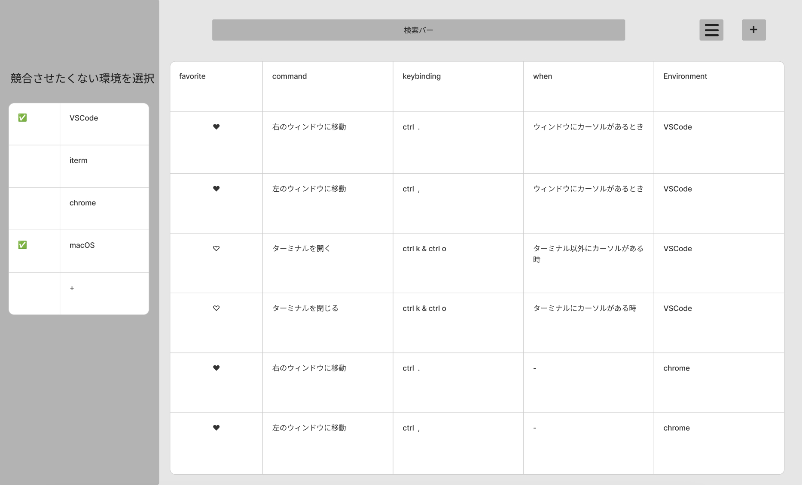
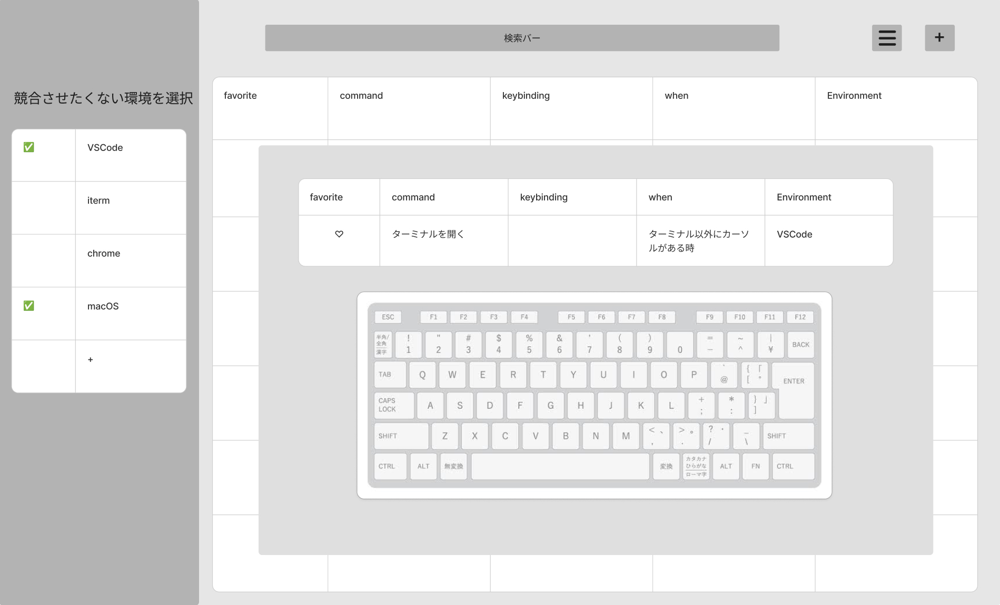
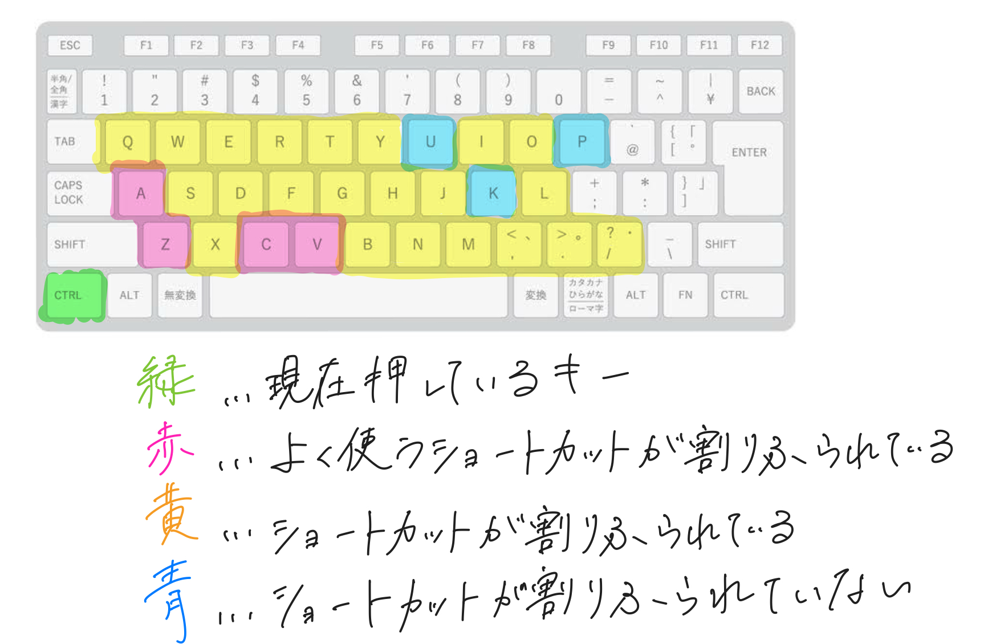

# ショートカットマネージャー　(現在はデプロイ停止中)

## 開発のきっかけ
私は普段からPCのショートカットを自作し多用しています。
最近は登録済みのショートカットの数が増えすぎてしまい、新しいショートカットを作成する際に競合が多発するため異なる環境間でのショートカットを一括で管理し、競合を起こさないキーを見つける際に発生する苦労をなくしたいと考え、本アプリを作成しました。

## ユーザの課題
* 競合を起こすショートカットを登録する際に気付けないため、何度も登録し直す手間がかかる
* 競合を起こさないショートカットを探すのに苦労する

## [機能一覧](https://rocky-iron-0a0.notion.site/fb73d265821a4c83852971d15e35187c?pvs=4)

## ER図

## インフラ構成

＊現在はサービスを停止しています

## 主な使用技術
| カテゴリー|技術スタック|
|-|-|
|フロントエンド|Next.js(14.2.3), sass(1.77.6)|
|バックエンド|Ruby(3.2.2), Ruby on Rails(7.1.3.3)|
|インフラ|AWS|
|DataBase|MySQL(8.0)|
|library|Axios|
|Gem|bcrypt, unicorn, puma, etc.|
|その他|Git, GitHub|

## 工夫した点
* bcrypt gemを用いて認証機能を実装した
* 競合を警告する機能で、すべてのショートカットの競合を警告するのではなく、警告するショートカットの環境を選択できるようにした
	
<!-- ------------------------------------------------------------- -->

# original product

## プロダクト概要
ショートカット作成時，  
競合を生まないショートカットを楽に探したい人のための  
shortcuts manager (仮) は  
ショートカット管理アプリです.  

これは 競合するショートカットを作成しようとしたらアラートを出す ことができ，  
関連アプリのCheatSheetやKeyCueとは違って，  
異なるプラットフォームでのショートカットの競合も検知することができます．  
例えば，OSに cmd + c (copy)が登録されているのに，ブラウザで同じキーに新しくショートカットを割り当てようとすると警告を発します．

## 動作 UI
[動作,UIはここから見れます](https://rocky-iron-0a0.notion.site/fb73d265821a4c83852971d15e35187c?pvs=4)

## プロダクト詳細
### メイン機能 ショートカット登録
1. ログインする
1. サイドバーからショートカットを競合させたくない環境を選択する  
（例えば，VSCodeとOSで競合を許さない．  
VSCodeとchromeは競合を許すなど．  
下の場合，VSCodeとmacOSが競合すると警告を鳴らす）

1. 画面右上の十字ボタンをクリックするとモーダルウィンドウのフォームが出現する  
keybiding以外の項目を入力する  

1. keybidingをクリックして，追加したいキーを入力する.  
例えば，ctrl + 他のキー　で作成したいとき，  
ctrlをしている間，下のようにカラーリングされる，  
この時，青いキーはショートカットが競合しないので  
ctrl + kを入力してreturnを押すと登録が完了する．  
tmuxなどの場合，初期状態で全てのキーにショートカットが登録されているのでお気に入り機能があると，競合が起こるが使っていないキーの黄色と，使っている赤で色分けすることができる．

### このアプリで解決したい課題
1. 新しくショートカットを作成するとき，どこに割り当てれば競合をなくせるかを楽に知りたい．
1. 既存のショートカット管理ツールは異なるプラットフォーム間でのショートカットを一括管理できない．(VSCode，ブラウザ，vim，OSなど)
1. CheatSheetなどのショートカット管理ツールはデフォルトで登録されているショートカットしか表示できない
1. KeyCueなどのリッチなショートカット管理アプリは，項目が多すぎて使いにくい，また異なるプラットフォームでの重複を検知できない

### テーマ
新しく作成するショートカットのキー選びを楽にする．

### コンセプト
これまでのショートカット管理アプリでは，異なるプラットフォームでのショートカットの重複を検知できなかった．  
そのため，システムに cmd + c (copy)が登録されているのに，ブラウザで同じキーに新しくショートカットを登録して競合を生んでしまう．という問題があった．  
このアプリでは新しいショートカット作成時の「競合を起こさないキーを試行錯誤する手間」をグッと削減できます．

### ソリューション 
1. 複数のプラットフォームでのショートカットを一括でかつシンプルに管理する.
1. ショートカット登録の際に競合するキーをわかりやすいUIで示す．

### ペルソナ
#### ペルソナ1：自分

**アプリの使用理由**
利用しているほぼ全てのツールで大量にショートカットを作成しているので競合を起こさないキーを探すのに手間がかかっている

**ショートカット使用頻度**
ほぼ全てのツールを自分好みにカスタマイズしている  

### 機能
#### 実装済み
* ショートカット登録
* ショートカット削除
* 登録の際，競合が出たらアラート
* よく使うショートカット（お気に入り）の登録
#### これから実装したい
* 使用していないキーセットを表示
* デフォルトのショートカットがすでに登録されている機能
* ~/.config/nvim/init.vimなどのショートカット管理ファイルから一括で登録
* このアプリでショートカットを作成して，コンフィグファイルに入力するコードを作成する
* 覚えたいショートカットの登録
* ショートカットのクイズ
### 工夫する点 
* シンプルで楽にショートカットを登録できる
* 異なるプラットフォームでのショートカットの競合を検知できるように設計する
### このアプリの強み
* ショートカットを一括で管理できる
### このアプリの弱点
* すでにショートカットを多用している人が，ショートカットを登録するのが大変

# 画面図
[figma](https://www.figma.com/board/jjMGHVcHFyKo6RE1qIp98p/keyboard-manager?node-id=0-1&t=iNUAdEzjnmch7nV6-0)

# DB
### ER図

# AWSアーキテクチャ図

＊現在はサービスを停止しています

